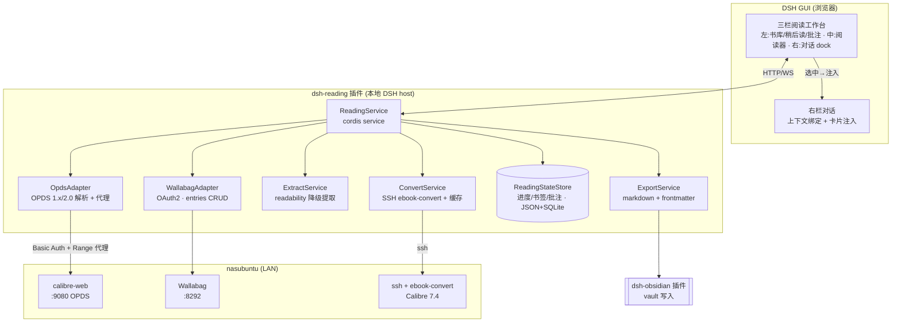
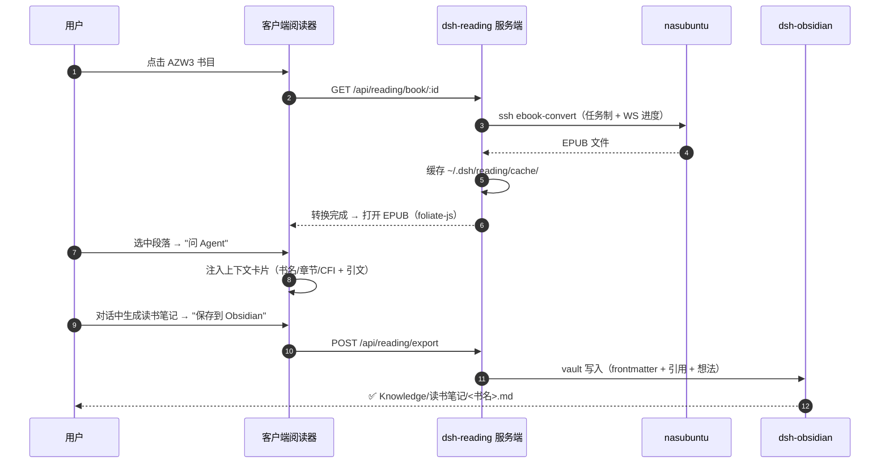

# dsh-reading v1 — 设计文档

> 状态：待确认（原型 + 本文档供评审）
> 插件包：`@dsh-plugins/dsh-reading`（新增，独立 SemVer）

## 1. 目标

在 DSH GUI 内提供沉浸式阅读工作台：阅读 EPUB / PDF / 网页文章（及无 DRM 的 Amazon 格式经转换后阅读），阅读过程中可一键把选中文本连同出处上下文发送给当前会话的 agent（搜索、解释、起草），高亮与批注可沉淀为带元数据的 Markdown 笔记写入 Obsidian vault。

## 2. 需求决策（已与需求方确认/默认）

| # | 决策点 | 结论 |
|---|--------|------|
| 1 | 界面形态 | **统一三栏工作台**：左栏 = 书库/稍后读/批注（标签切换）；中栏 = 阅读器；右栏 = 当前对话（常驻）。打开书/文章时右栏对话自动绑定上下文（书名/章节/位置或文章 URL），选中发送即插入该对话 |
| 2 | Amazon 格式 | 仅无 DRM；AZW3/MOBI/AZW 导入时经 nasubuntu `ebook-convert` 转 EPUB，本地缓存；DRM 文件明确报错 |
| 3 | URL 阅读 | **Wallabag 统一入口**：一键收藏（插件代存）或先收藏后阅读；Wallabag 不可用时降级本地 `@mozilla/readability` 提取 |
| 4 | OPDS | 书源适配器支持 OPDS（calibre-web `:9080`/opds，Basic Auth；Talebook OPDS 为备选），浏览器侧请求全部经插件服务端代理（绕开 CORS，支持 Range） |
| 5 | Agent 交互 | 选中文本 → 浮动工具条 → 一键注入当前对话，自动附带 书名/章节/位置 上下文卡片 |
| 6 | Obsidian 沉淀 | 高亮/批注 → 生成新笔记（复用 dsh-obsidian 写入），frontmatter 含 book_title、author、chapter、location(CFI/页码)、source_url、tags |
| 7 | 阅读进度 | 本地持久化（`~/.dsh/reading/`），暂不做多设备同步 |
| 8 | 书库 | 双源：本地导入 + OPDS（nas 书库）；Koodo Reader 不嵌入（无法 hook 选区事件） |
| 9 | 设置分层 | 连接/密钥类走部署级 `.env`（见 §4.3）；阅读偏好（字体/字号/主题/行距/翻页模式/快捷键）进 DSH 设置页（`dsh-client-ui-settings-plugins` 锚点，用户级、随 profile 持久化） |

## 3. 现状盘点（nasubuntu · 192.168.88.22）

| 资产 | 端点/路径 | 用途 |
|------|-----------|------|
| Calibre 7.4（原生） | `/usr/bin/ebook-convert`、`calibredb` | SSH 远程转换 AZW3/MOBI→EPUB |
| Calibre 书库 | `/mnt/books/Calibre Library` | ~1,247 本：361 PDF / 302 EPUB / 291 MOBI / 229 AZW3 / 68 AZW |
| calibre-web（docker） | `:9080/opds` | OPDS 书源（401，Basic Auth） |
| Talebook（docker） | `:9088/opds` | 备选 OPDS 书源（401） |
| Wallabag 2.6.14（docker） | `:8292/api` | URL 收藏 / 稍后读 / 正文提取（REST + OAuth2） |
| Koodo Reader（docker） | `:28888` | 仅参考，不集成 |

## 4. 架构



### 4.1 模块划分

**服务端（`src/`，cordis plugin，对齐 dsh-obsidian）**
- `index.ts` / `contracts.ts` — 插件入口与配置契约（sources、nas SSH 别名、wallabag origin、缓存目录）
- `opds-adapter.ts` — OPDS acquisition feed 解析（feedparser 自研轻量解析），封面与电子书文件走服务端代理流（PDF 必须支持 `Range` 请求，PDF.js 依赖）
- `wallabag-adapter.ts` — OAuth2 client_credentials 令牌管理，entries 列表/新增/归档，正文 html 拉取与净化（DOMPurify）
- `extract-service.ts` — URL 抓取 + `@mozilla/readability` 提取（Wallabag 不可用时的降级路径），同时负责"收藏时提取"的摘要生成
- `convert-service.ts` — `ssh nasubuntu ebook-convert in.azw3 out.epub`，异步任务 + `~/.dsh/reading/cache/<hash>/` 缓存，进度通过 WS 推送
- `state-store.ts` — 阅读进度（EPUB CFI / PDF page+scroll / article scroll 百分比）、书签、批注；JSON 文件起步，预留 SQLite
- `export-service.ts` — 渲染 markdown（frontmatter + 引用 + 想法），调用 dsh-obsidian 的 vault 写入契约（HTTP API），返回写入路径
- `http-api.ts` — REST 路由：`/api/reading/library|book/:id/file|opds/proxy|wallabag/entries|annotations|export`

**客户端（`src/client/`，React 注入）— 统一三栏工作台**
- `Workbench.tsx` — 三栏容器：左栏 `SourceColumn`（书库/稍后读/批注标签切换）、中栏 `ReaderColumn`（阅读器）、右栏 `ChatDock`（常驻对话 dock，注入上下文卡片）；左右栏可折叠
- `LibraryView.tsx` — 书库：OPDS 源浏览/搜索、本地导入、格式徽章与转换状态
- `ReadLaterView.tsx` — Wallabag 稍后读列表 + 添加 URL
- `AnnotationsPanel.tsx` — 批注中心 + Obsidian 导出预览
- `ReaderView.tsx` — 阅读器外壳：目录抽屉、字号/主题、进度条、书签
- `EpubPane.tsx` / `PdfPane.tsx` / `ArticlePane.tsx` — foliate-js / PDF.js（服务端 Range 代理）/ 文章排版渲染层
- `SelectionBridge.tsx` — 选区监听 → 浮动工具条 → 上下文卡片注入右侧 `ChatDock`
- `ContextBinding.ts` — 当前打开实体（书/文章）状态；打开即绑定，对话 composer 上方常驻上下文条（📖 书名·章节·CFI / 🔗 文章标题·domain）；选中"问 Agent"直接落入右栏对话
- `SettingsPanel.tsx` — 阅读偏好设置页（注入 `dsh-client-ui-settings-plugins`）：字体族、字号、行距、主题（dark/paper/sepia）、边距、翻页模式（滚动/分页）、选区工具条开关、快捷键

### 4.2 格式技术选型

| 格式 | 方案 | 备选 |
|------|------|------|
| EPUB | **foliate-js**（渲染质量好、annotation/CFI 能力全） | epub.js（社区大，出问题可切） |
| PDF | **pdf.js**（Mozilla 官方） | — |
| AZW3/MOBI/AZW | SSH → `ebook-convert` → EPUB 缓存 | —（不做原生渲染） |
| URL | **Wallabag API**（主）/ readability（降级） | — |

### 4.3 配置契约（部署级，已落地）

配置分两个文件（均已在本机 `~/.local/dsh_home/` 生效，e2e 验证通过）：

**`$DSH_HOME/.env` — 非密钥部署配置**（DSH 宿主自动加载为最低优先级 env 层）：数据目录、OPDS 源名称/URL/认证方式/用户名、Wallabag URL/CLIENT_ID、SSH 转换目标、Obsidian 导出目录、抓取超时等，见 `docs/plans/dsh-reading-v1.env.example`。

**`$DSH_HOME/.credentials.yaml` 的 `refs:` — 密钥**（与 API keys 同库，600 权限，watch 热加载）：`DSH_READING_OPDS_0_PASSWORD`、`DSH_READING_WALLABAG_CLIENT_SECRET`、`DSH_READING_WALLABAG_USERNAME`、`DSH_READING_WALLABAG_PASSWORD`。

插件解析顺序对齐宿主约定：进程环境 > credentials refs > `$DSH_HOME/.env`；密钥不回传客户端、不进 `dump-config`。多主机部署 = 每台复制两个文件改值，变量名不变。

**nas 侧现状（e2e 已验证，2026-09-12）**：

| 端点 | 地址 | 验证结果 |
|------|------|---------|
| calibre-web OPDS | `http://192.168.88.22:9083/opds`（须用 9083 直连后端；9080 的 nginx 会剥掉 Authorization 头导致 400） | 浏览/搜索/new/discover ✅ 下载 ✅ Range 206 ✅ 封面 ✅ |
| Wallabag | `http://192.168.88.22:8292` | 专用账号 `dshreading` + client `dsh-reading`，OAuth password 授权 ✅ |
| SSH 转换 | `nasubuntu`（~/.ssh/config alias） | ebook-convert 7.4 ✅ |
| OPDS 账号 | `dshreading`（calibre-web，role=338） | 手工插入 user 表时 `view_settings` 等字段必须非空（`{}`/`''`），否则 OPDS/页面返回空或 500 |
| 书库 schema | `metadata.db` 缺 `books.isbn/flags` 导致 OPDS 内容路由 500 | 已按 Calibre 7.4 定义补列（user_version 保持 27；talebook 5.12 / calibre-web 5.44 / host 7.4 读验均通过），备份 `metadata.db.bak-20260912` |

### 4.4 设置页（用户级偏好）

连接配置不放 GUI（部署级 `.env` 权威）；GUI 设置页只放阅读偏好，存 profile 级配置，服务端/客户端共享：

- 字体族（系统默认 / 宋体系 / 黑体系 / 衬线西文）、字号（12–24）、行距、页边距
- 主题：dark / paper / sepia；跟随 DSH 主题开关
- 翻页模式：滚动 / 分页（EPUB）、PDF 连续/单页
- 选区工具条按钮自定义（问 Agent / 高亮 / 批注 / 复制开关与顺序）
- 快捷键：问 Agent、高亮、目录、切换栏

## 5. 数据模型

```typescript
interface Book {
  id: string;                    // source:opds:<entryId> | local:<sha1>
  source: 'opds' | 'local';
  title: string; author?: string;
  formats: Array<'epub'|'pdf'|'azw3'|'mobi'|'azw'>;
  href: string;                  // OPDS acquisition link（代理后）
  coverHref?: string;
  publisher?: string; tags?: string[];
  convertedTo?: { path: string; at: string };  // Amazon 格式转换结果缓存
}

interface Article {
  id: string;                    // wallabag:<entryId> | extract:<urlHash>
  url: string; title: string;
  domain: string; readingTimeMin?: number;
  isArchived: boolean; savedAt: string;
  extractedHtml?: string;        // 服务端净化后
}

interface ReadingProgress {
  bookId: string;
  locator:                       // 格式相关定位
    | { type: 'epub'; cfi: string; chapterHref: string }
    | { type: 'pdf'; page: number; scrollRatio: number }
    | { type: 'article'; scrollRatio: number };
  percent: number;
  updatedAt: string;
}

interface Annotation {
  id: string;
  bookId: string;
  locator: ReadingProgress['locator'];
  chapter?: string;
  quote: string;                  // 选中文本
  note?: string;                  // 我的想法
  color: 'yellow'|'green'|'blue'|'pink';
  createdAt: string;
  exportedTo?: { path: string; at: string };  // Obsidian 导出记录
}

interface SourceConfig {
  opds?: Array<{ id: string; name: string; url: string; auth: 'basic'|'bearer'; secretRef: string }>;
  wallabag?: { origin: string; clientId: string; clientSecret: string; username: string; password: string };
  nasSshTarget?: string;          // e.g. "nasubuntu"
}
```

## 6. 关键流程



## 7. 里程碑

| 里程碑 | 内容 | 验收 |
|--------|------|------|
| **M1 阅读内核** | 插件骨架 + EPUB（foliate-js）+ PDF（pdf.js）本地打开、进度持久化、目录/字号/主题 | 本地 EPUB/PDF 可读、进度可恢复 |
| **M2 书源** | OPDS 适配器（calibre-web 全量浏览/搜索/下载代理）+ 本地导入 | nas 书库可浏览、AZW3 显示"需转换" |
| **M3 转换与批注** | SSH ebook-convert 转换缓存 + 选区工具条 + 高亮/批注中心 | AZW3 可转换阅读；批注可增删查 |
| **M4 Wallabag 与沉淀** | Wallabag 收藏/稍后读/提取 + 上下文卡片注入对话 + Obsidian 导出 | URL 一键收藏可读；高亮导出为 vault 笔记 |

## 8. 风险与对策

| 风险 | 对策 |
|------|------|
| foliate-js 维护活跃度 | 渲染层抽象接口，可整体替换 epub.js |
| calibre-web OPDS 需 Basic Auth（401） | 配置中存 secretRef；首次引导创建/校验 OPDS 账号 |
| Wallabag 仅 LAN 可达 | 提取降级 readiness 探测：Wallabag 不可达自动走本地 readability，UI 打标 |
| PDF.js 需要 Range 流 | 文件代理必须透传 `Range` 并正确处理 206，M1 即测试 |
| DRM 文件 | 转换前探测（`ebook-convert` 失败特征），明确报错"不支持 DRM" |
| NAS 离线 | 转换缓存 + 已下载文件本地可用；书源列表缓存最后快照 |

## 9. 复用与依赖

- 复用 `@dsh-plugins/dsh-obsidian` 的 vault 写入 HTTP API（不直写 vault，保证 bundle reconciliation 权威）
- 对齐 dsh-obsidian 的打包/版本/发布规范（`cordis.patch.yml`、`release:check`、`dsh-reading-v<version>` 标签）
- 新增依赖：`ssh2`（或复用系统 ssh）、`@mozilla/readability`+`jsdom`、`pdfjs-dist`、`foliate-js`、`dompurify`
